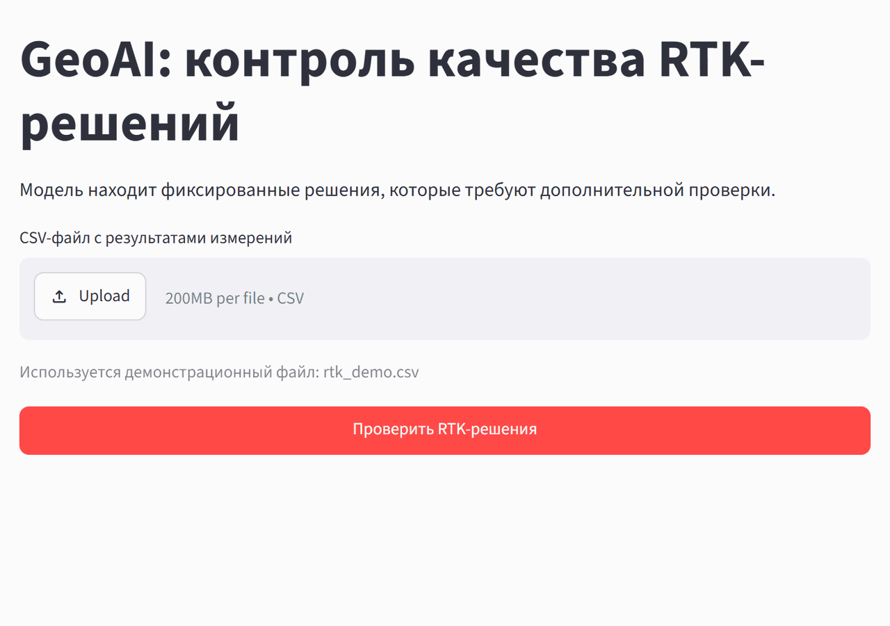
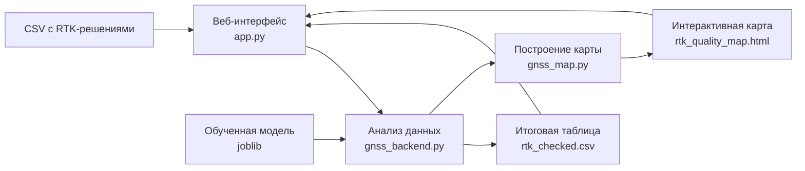

# 🛰️ GeoAI: контроль качества RTK-решений

<div align="center">


### Веб-приложение для вторичного контроля фиксированных RTK-решений

[Возможности](#-возможности) • [Архитектура](#️-архитектура) • [Быстрый старт](#-быстрый-старт) • [Как работает модель](#-как-работает-модель)

</div>

---

## 🎥 Демонстрация

<div align="center">
  
</div>

---

## 🎯 Задача проекта

RTK — способ спутникового определения координат с использованием поправок от базовой станции. Приёмник последовательно выдаёт координаты; каждый момент, для которого получено решение, называют **эпохой измерений**. Например, при записи раз в секунду час работы даёт тысячи таких эпох.

Статус `FIX` означает, что алгоритм разрешил целочисленные неоднозначности фазовых измерений. Это важный признак для получения точных координат, но не гарантия их правильности: например, отражения спутникового сигнала от зданий могут привести к ошибке даже у фиксированного решения.

Поэтому модель обучалась выполнять **вторичный контроль уже фиксированных решений**. В учебных данных координаты сопоставлялись с опорной траекторией, чтобы выделить эпохи с горизонтальной ошибкой более 0,30 м. Модель училась связывать такие превышения с четырьмя диагностическими показателями приёмника. При применении ей не нужна опорная траектория: она рассчитывает оценку риска по этим показателям.

Пользователь загружает подготовленный CSV с фиксированными RTK-решениями и получает таблицу и карту с эпохами, требующими дополнительной проверки. Приложение не обрабатывает сырые спутниковые наблюдения, не исправляет координаты и не удаляет измерения автоматически. Оно помогает специалисту найти потенциально проблемные участки и решить, какие результаты нужно проверить подробнее.

Постановка задачи, подготовка данных, обучение модели и проверка её качества подробно рассмотрены в [учебном блокноте в Google Colab](https://colab.research.google.com/drive/11Y1cc4qv-j1Gm9AWDov47GBf6HwEQQrN?usp=sharing). Здесь используется сохранённая модель из этого занятия — повторно обучать её для запуска приложения не нужно.

Наглядный обзор задачи, структуры приложения и этапов его разработки — в [презентации к занятиям](https://drive.google.com/file/d/1lK0c5Hs6st5Ufe6eMLpuPkga8fr9Iq3b/view?usp=sharing).

## 🚀 Возможности

| Работа с данными | Представление результата |
|---|---|
| Загрузка собственного CSV-файла | Число обработанных эпох |
| Демонстрационный набор для быстрого запуска | Число решений без дополнительной проверки |
| Проверка наличия признаков модели | Число решений, требующих проверки |
| Расчёт оценки риска для каждой эпохи | Распределение решений по категориям |
| Сохранение итоговой таблицы | Интерактивная карта маршрута |
| Работа с данными без эталонных координат | Выгрузка CSV и автономной HTML-карты |

## 🏗️ Архитектура



- `app.py` — фронтенд: загрузка файла, запуск обработки и отображение результата.
- `gnss_backend.py` — бэкенд: чтение данных, применение модели и сохранение таблицы.
- `gnss_map.py` — построение интерактивной карты по результатам контроля.

## 💻 Технологический стек

- **Streamlit** — веб-интерфейс приложения.
- **pandas** — чтение и обработка табличных данных.
- **scikit-learn** и **joblib** — применение обученной модели.
- **Plotly** — интерактивная карта маршрута и результатов контроля.
- **uv** — загрузка Python для запуска приложения; библиотеки устанавливаются через pip.

## 🚀 Быстрый старт

### Скачать и запустить

**Заранее устанавливать Python, uv и библиотеки не требуется.** Скачайте проект с GitHub через **Code → Download ZIP**, распакуйте архив и откройте папку с `app.py`, `requirements.txt` и скриптами запуска. Модель в `models` и пример данных в `data` уже входят в проект.

### Windows

Дважды щёлкните **`START_WINDOWS.bat`** и дождитесь открытия приложения в браузере. Запускайте файл из распакованной папки, а не из ZIP-архива.

### Linux и macOS

Откройте терминал в папке проекта и выполните:

```bash
bash START_UNIX.sh
```

Для загрузки установщика нужна программа `curl`; на большинстве систем она уже установлена.

### Что происходит при запуске

Скрипт загружает uv и Python 3.12, создаёт виртуальное окружение `.venv`, устанавливает библиотеки из `requirements.txt` и запускает Streamlit. Страница приложения открывается автоматически по адресу [http://127.0.0.1:8501](http://127.0.0.1:8501). Если браузер не открылся, перейдите по этому адресу самостоятельно.

Все инструменты, окружение, кеши и временные файлы находятся **внутри папки проекта**: в `.runtime` и `.venv`. При повторном запуске скрипт использует уже установленное окружение и проверяет зависимости. Для загрузки недостающих компонентов и картографической подложки OpenStreetMap нужен интернет; порт `8501` должен быть свободен.

Пока приложение работает, оставляйте окно терминала открытым. Чтобы остановить сервер, нажмите в нём **Ctrl+C**. Приложение работает локально на вашем компьютере и не публикуется в интернете.

Скрипты подходят и для других локальных приложений на Streamlit: рядом должны находиться `app.py`, `requirements.txt` со `streamlit` и остальные файлы проекта. Код и зависимости должны быть совместимы с Python 3.12 и выбранной операционной системой. При передаче проекта другому пользователю папки `.runtime` и `.venv` включать в архив не нужно — скрипт создаст их на его компьютере.

<details>
<summary><strong>Ручной запуск, если Python 3.12 уже установлен</strong></summary>

В Windows откройте PowerShell в папке проекта:

```powershell
python -m venv .venv
.venv\Scripts\python.exe -m pip install -r requirements.txt
.venv\Scripts\python.exe -m streamlit run app.py --server.address 127.0.0.1 --server.port 8501
```

В Linux или macOS:

```bash
python3.12 -m venv .venv
.venv/bin/python -m pip install -r requirements.txt
.venv/bin/python -m streamlit run app.py --server.address 127.0.0.1 --server.port 8501
```

</details>

## 📖 Работа с приложением

1. Оставьте поле загрузки пустым, чтобы использовать демонстрационный набор, или выберите собственный CSV-файл.
2. Нажмите **«Проверить RTK-решения»**.
3. Сравните число принятых эпох и эпох, направленных на дополнительную проверку.
4. Рассмотрите расположение результатов на интерактивной карте.
5. Наведите указатель на точку, чтобы увидеть признаки измерения и оценку риска.
6. Скачайте итоговую таблицу или автономную HTML-карту.

## 🧠 Как работает модель

В комплект входит конвейер логистической регрессии, обученный на фиксированных RTK-решениях. Перед классификацией пропуски заменяются медианами, а числовые признаки стандартизуются.

Модель использует четыре диагностических признака:

| Поле | Содержание |
|---|---|
| `ratio` | показатель надёжности фиксации |
| `n_sat_solution` | число спутников в решении |
| `pos_sigma_h` | оценка горизонтальной точности |
| `pos_sigma_v` | оценка вертикальной точности |

Для каждой эпохи рассчитывается `risk_score`. Если он **строго больше порога**, решение получает признак `requires_review = True` и направляется на дополнительную проверку. При меньшем или равном значении дополнительная проверка по решению модели не требуется.

### Откуда взят порог 0.1574

Порог подобран в блокноте при подготовке модели, а не задан произвольно в приложении. Данные разделяли на пространственные группы и получали прогнозы для групп, не участвовавших в обучении соответствующей модели. По этим вневыборочным прогнозам выбирали порог, который сохраняет наибольшую среднюю по группам долю решений в пределах допуска. При этом средняя по группам доля пропущенных превышений (**MDR**) должна была составлять **не более 2%**. Пропуск — это случай, когда ошибка превышает допуск, но решение остаётся принятым.

Полученный порог сохранён вместе с моделью в Joblib: `0.15739617341443357`. Приложение читает именно это значение; `0.1574` — его округлённое отображение. Ограничение 2% относится к процедуре выбора порога на учебных данных и не гарантирует такой же результат на новых измерениях.

Важно различать **0,30 м** — горизонтальный допуск учебного эксперимента, использованный для разметки данных, и **0.1574** — порог безразмерной оценки риска. Ни одно из этих значений не является универсальным нормативом для RTK. `risk_score` помогает ранжировать решения, но не показывает ошибку в метрах и не является откалиброванной вероятностью ошибки.

## 📥 Формат входных данных

Для полного сценария работы приложению нужны следующие столбцы:

| Поля | Назначение |
|---|---|
| `ratio`, `n_sat_solution`, `pos_sigma_h`, `pos_sigma_v` | признаки модели |
| `fixed_lat_deg`, `fixed_lon_deg` | координаты RTK-решения |
| `gps_seconds` | порядок точек маршрута |
| `output_time` | время решения во всплывающей подсказке |

Эталонные поля необязательны:

- `fixed_error_h` позволяет ретроспективно сравнить решение модели с фактическим превышением допуска;
- `reference_lat_deg` и `reference_lon_deg` позволяют показать на карте опорную траекторию.

Если эталонных полей нет, модель всё равно разделит реальные измерения на две рабочие категории: **«Принято без дополнительной проверки»** и **«Требуется дополнительная проверка»**.

## 📤 Результаты

После обработки в папке `results` создаются:

- `rtk_checked.csv` — исходные данные, `risk_score`, решение модели и категория качества;
- `rtk_quality_map.html` — самостоятельная интерактивная карта, которую можно открыть в браузере.

На демонстрационном наборе приложение обрабатывает 4 631 эпоху и направляет 90 из них на дополнительную проверку. Поскольку в наборе присутствует эталонная ошибка, результат дополнительно разделяется на четыре учебные категории.

### Пример итоговой таблицы

Ниже — 10 строк из `results/rtk_checked.csv` с наибольшим `risk_score`, отсортированных по убыванию. Показаны основные столбцы; значения риска и ошибки округлены до четырёх знаков. Все строки относятся к маршруту `DATA13` за 18.11.2021; в столбце «Время» приведена временная часть `output_time`, а в столбце «Эпоха» — `epoch_id`.

| Эпоха | Время | `risk_score` | `requires_review` | `fixed_error_h`, м | Категория |
|:---:|:---:|:---:|:---:|:---:|---|
| 2197 | 05:31:24 | 1.0000 | True | 0.7021 | Превышение допуска — обнаружено |
| 2198 | 05:31:25 | 1.0000 | True | 0.3139 | Превышение допуска — обнаружено |
| 2199 | 05:31:27 | 1.0000 | True | 1.0406 | Превышение допуска — обнаружено |
| 2647 | 05:53:06 | 0.9722 | True | 0.9616 | Превышение допуска — обнаружено |
| 2213 | 05:32:34 | 0.9265 | True | 0.0568 | В пределах допуска — требуется проверка |
| 2685 | 05:59:56 | 0.8638 | True | 0.0311 | В пределах допуска — требуется проверка |
| 2173 | 05:29:07 | 0.8464 | True | 0.0304 | В пределах допуска — требуется проверка |
| 2965 | 06:05:26 | 0.8045 | True | 0.0260 | В пределах допуска — требуется проверка |
| 2964 | 06:05:21 | 0.7092 | True | 0.0296 | В пределах допуска — требуется проверка |
| 3009 | 06:06:40 | 0.6493 | True | 0.0346 | В пределах допуска — требуется проверка |

Все эти эпохи направлены на проверку (`requires_review = True`). При этом часть из них по опорным данным укладывается в допуск 0,30 м: высокая оценка риска — повод проверить измерение, а не подтверждение ошибки координат.

## 📂 Структура проекта

```text
GNSS_Quality_App/
├── data/
│   └── rtk_demo.csv
├── models/
│   └── lr4_rtk_quality_model.joblib
├── results/
│   ├── rtk_checked.csv
│   └── rtk_quality_map.html
├── app.py
├── gnss_backend.py
├── gnss_map.py
├── START_WINDOWS.bat
├── START_UNIX.sh
├── gnss_quality_demo.gif
├── README.md
└── requirements.txt
```

Папки `.runtime/` и `.venv/` создаются при запуске скрипта и не относятся к исходным файлам проекта.

## ⚠️ Область применения

Проект является учебным примером прикладного использования модели машинного обучения. Решение о пригодности геодезических измерений принимает специалист с учётом методики работ, оборудования и результатов полного контроля качества.
